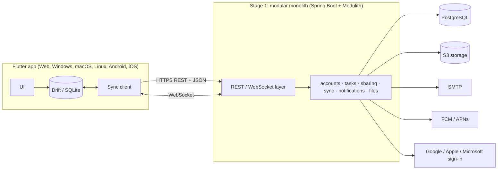

# Architecture

> **Status:** the stack below has been chosen, but not implemented yet. Update this document whenever the code diverges from it.

Future Todo is a cross-platform task manager modeled on Microsoft To Do. It has clients for Web, Windows, macOS, Linux, Android, and iOS, and a server that handles storage, sync between devices, sharing, and notifications. The requirements come from the project's SRS. `FR-x.y` and `PR-n` below refer to its functional and performance requirements.

The server is built in two stages:

1. **Stage 1: modular monolith.** One backend application with one database, split into modules with strict boundaries.
2. **Stage 2: microservices.** Modules are pulled out into services one at a time (Strangler Fig pattern). **Clients see no change to the external API.**

## Stack at a glance

| Layer | Technology |
|---|---|
| Client (all 6 platforms) | Flutter (Dart), Riverpod, go_router |
| Client local storage | Drift (SQLite; WebAssembly build on web) |
| API contract | REST + JSON, OpenAPI 3 generated by springdoc, Dart client generated with `openapi-generator` (`dart-dio`) |
| Real-time | WebSocket |
| Backend | Kotlin, Spring Boot, Spring Modulith, Gradle (Kotlin DSL) |
| Database | PostgreSQL (one schema per module), Flyway migrations |
| Auth | Spring Security, JWTs issued by the backend, Argon2 password hashing, Bucket4j rate limiting |
| Search | PostgreSQL full-text search (server), SQLite FTS5 (client, offline) |
| Files / email | S3-compatible storage (MinIO locally), SMTP (Mailpit locally) |
| Push | Firebase Cloud Messaging (Android, iOS via APNs, Web); local notifications for reminders |
| Stage 2 additions | RabbitMQ, Spring Cloud Gateway, Redis |
| CI/CD | GitHub Actions, Docker images on GitHub Container Registry (GHCR) |

## System overview



## Planned repository layout

```
app/            Flutter client (all platforms)
backend/        Spring Boot modular monolith
api/            openapi.json, generated from the backend and committed
docker-compose.yml   Postgres, MinIO, Mailpit for local development
```

## Client

**Flutter** is the only mature option that serves all six targets from one codebase with the same UI. Platform-specific features live in small platform modules rather than in separate apps.

The client works **offline-first**. The UI reads and writes only the local Drift database and never waits on the network. A sync component moves changes between the local database and the server in the background (FR-8.1, FR-8.2) and shows the sync state (FR-8.4). Offline search uses SQLite FTS5 through Drift (FR-7).

| Concern | Choice |
|---|---|
| State management | Riverpod |
| Routing | go_router |
| API access | Dart client generated from `api/openapi.json`; never hand-written HTTP calls |
| Reminders (FR-3.5, FR-6.1) | `flutter_local_notifications`: each device schedules reminders from its local data, so reminders fire offline and on desktop platforms, which have no push service |
| Server push (FR-6.3) | `firebase_messaging`, used for events that come from other users, such as a task being assigned to you |
| Home-screen widgets (FR-10.1) | `home_widget` |
| Global quick-add hotkey (FR-10.2) | `hotkey_manager` |
| PWA (FR-10.3) | Flutter web's built-in PWA support |
| Localization (FR-9.2) | `flutter_localizations` + ARB translation files (uk, en) |
| Lint | `very_good_analysis` |

Trade-off of scheduling reminders locally: a device only fires a reminder once it has synced after the reminder was set.

## Backend (Stage 1)

### Modules and boundaries

The backend is one Spring Boot application with one top-level package per module:

| Module | Responsibility | Requirements |
|---|---|---|
| `accounts` | Registration, login, OAuth, sessions, profile, data export and deletion, admin | FR-1, FR-11 |
| `tasks` | Lists, groups, tasks, steps, recurrence, smart lists, search | FR-2, FR-3, FR-4, FR-7 |
| `sharing` | Invitations, members, permissions, task assignment | FR-5 |
| `sync` | Change log, pushing and pulling changes, WebSocket fan-out | FR-8, FR-5.6 |
| `notifications` | Server push, email digest, notification preferences | FR-6 |
| `files` | Attachment upload, storage, download | FR-3.9 |

Boundary rules:

- **A module never reads or writes another module's tables.** Each module owns its own PostgreSQL schema, managed by Flyway migrations.
- Modules talk to each other only through a public interface (the module's top-level package) or through **application events**. Everything else in a module stays internal.
- **Spring Modulith** enforces this. A test calls `ApplicationModules.verify()`, and the build fails if one module depends on another's internals.

These rules make Stage 2 mechanical. A module that already owns its schema and communicates through events can be moved into its own service.

### API

- REST + JSON over HTTPS, versioned under `/api/v1`. The previous version stays backward compatible for at least one version.
- The OpenAPI 3 spec is generated from the code by springdoc and committed as `api/openapi.json`. CI regenerates it and fails if it differs from the committed file. **A change to that file is a change to the public API** and needs deliberate review, because Stage 2 must not change it.
- A WebSocket endpoint pushes change notifications, so that changes appear on other devices and for collaborators within 5 seconds (FR-5.6, PR-3).

### Auth and security

- Email + password, with passwords hashed using Argon2 (`Argon2PasswordEncoder`).
- Google, Apple, and Microsoft sign-in: the client gets an ID token from the provider, and the backend verifies it before issuing its own tokens.
- The backend issues JWT access tokens that expire after 15 minutes. Refresh tokens are rotated on use and stored hashed. Sessions can be listed and revoked (FR-1.5).
- Login and other sensitive endpoints are rate-limited with Bucket4j.
- Every query is limited to the caller's own data plus lists shared with them. `sharing` is the module that decides access.

### Search, files, email

- **Search:** PostgreSQL full-text search with the `simple` configuration, because PostgreSQL has no Ukrainian stemmer and `simple` works for both languages. Searches task titles, notes, and steps.
- **Files:** stored in S3-compatible storage through the AWS SDK. MinIO runs locally. Attachments are limited to 25 MB each.
- **Email:** sent over SMTP. Mailpit catches all mail locally.

## Sync design

Sync is the most complex part of the system. The design:

- **Hybrid logical clocks (HLC).** Every change is stamped with an HLC timestamp: physical time + counter + device ID. This orders changes correctly even when a device's clock is wrong.
- **Field-level last-write-wins (FR-8.3).** Each synced field stores the HLC of its last change. When two edits hit the same field, the newer HLC wins. Edits to different fields of the same task both survive.
- **Deletes are tombstones.** A deleted row is marked as deleted rather than removed immediately, so that deletions also sync.
- **Push:** the client sends its queued changes. `sync` hands each one to the module that owns the data (e.g. `tasks`) through that module's public interface. The owning module applies the last-write-wins rule, because only it may touch its tables.
- **Change log:** owning modules publish events for applied changes. `sync` records these in its own change log, where each entry gets an ever-increasing sequence number.
- **Pull:** a client asks for everything after the last sequence number it saw. A WebSocket message tells connected clients to pull now, instead of waiting for the next poll.

## Stage 2: microservices

Modules are pulled out one at a time behind an API gateway (Strangler Fig pattern). Clients keep calling the same `/api/v1` endpoints throughout.

| Stage 1 module | Stage 2 service |
|---|---|
| `accounts` | Identity Service |
| `tasks` | Task Service; search moves to a separate Search Service |
| `sharing` | Sharing Service |
| `sync` | Sync Service |
| `notifications` | Notification Service |
| `files` | File Service |
| — | API Gateway (Spring Cloud Gateway): routing, request authentication, rate limiting |

- Spring Modulith's event externalization publishes the existing module events to **RabbitMQ**. Code that sends events doesn't change when its consumer moves to another process.
- Each service takes its own PostgreSQL schema with it and then owns that database. It is packaged as a container and deployed independently.
- **Redis** passes WebSocket updates between instances of the Sync Service.
- The API tests written in Stage 1 are rerun against the gateway to prove the external API didn't change.

## Testing

Development is test-driven (XP). The SRS requires at least **80% test coverage**, and every change has to pass the tests in CI.

| Level | Client | Backend |
|---|---|---|
| Unit | `flutter_test` (logic and widget tests) | JUnit 5 + MockK |
| Integration | Drift database tests, repository tests | Spring Boot tests with **Testcontainers** (real PostgreSQL); `@ApplicationModuleTest` per module; `ApplicationModules.verify()` |
| End-to-end | `integration_test` running against the Docker Compose backend (in CI: Linux desktop build under Xvfb, a virtual display) | API tests at the HTTP level; the same tests guard the API during Stage 2 |

Coverage is measured with Kover (backend) and `flutter test --coverage` (client). The first tests to write:

- **Unit:** creating the next occurrence of a repeating task (FR-3.6).
- **Integration:** a task endpoint with its repository, running against PostgreSQL.
- **End-to-end:** creating a task in the app and seeing it in the list.

## Static analysis, CI/CD, environments

- **Static analysis:** detekt + ktlint (backend), `dart analyze` with `very_good_analysis` (client), the Spring Modulith boundary check, and the OpenAPI spec check.
- **CI (GitHub Actions)** runs on every push and PR: build → static analysis → tests → coverage gate.
- **CD:** the backend is built into a Docker image and pushed to GHCR. The Flutter web build is published as a static site. Both are deployed to a test environment.
- **Local development:** `docker compose up` starts PostgreSQL, MinIO, and Mailpit.

## Decisions and alternatives considered

| Decision | Alternatives | Why this choice |
|---|---|---|
| Flutter | React Native, Compose Multiplatform, Tauri | Flutter is mature on all six targets. React Native's desktop support and Compose Multiplatform's web support are weaker. Tauri renders in a web view and has limited native mobile integration. |
| Drift | Isar, Hive, ObjectBox | Drift is relational (matches the server model), handles schema migrations, updates the UI when data changes, supports full-text search, and runs on web. |
| Kotlin + Spring Boot + Spring Modulith | NestJS (TypeScript), .NET, Dart backend | Spring Modulith enforces module boundaries and forwards events to a message broker, which directly supports the Stage 1 → Stage 2 plan. NestJS would need boundaries enforced with `dependency-cruiser`, a separately configured check. A Dart backend lacks mature libraries for OAuth, S3, and message brokers. |
| Backend-issued JWTs | Keycloak / hosted identity provider | The SRS plans an in-house Identity Service. Keycloak adds a heavy service to run for what is a small feature set. |
| Custom sync | PowerSync, ElectricSQL | The SRS requires a REST API and a dedicated Sync service with field-level conflict resolution. An off-the-shelf sync engine would replace both. |
| Code-first OpenAPI with the spec committed | Spec-first code generation | Less generated code to maintain on the server. The committed spec plus the CI check still protects the API contract. |
| RabbitMQ (Stage 2) | Kafka | Simpler to operate, and enough for the expected event volume. Spring Modulith supports both. |

## Known constraints

- **Apple platforms:** iOS and macOS builds need a Mac. Push notifications, home-screen widgets, and Sign in with Apple also need a paid Apple Developer account. Web, Android, Windows, and Linux can be built and demonstrated without either.
- **Flutter web:** the first load is large, and Drift on web needs `sqlite3.wasm` and a web worker to be served alongside the app.
